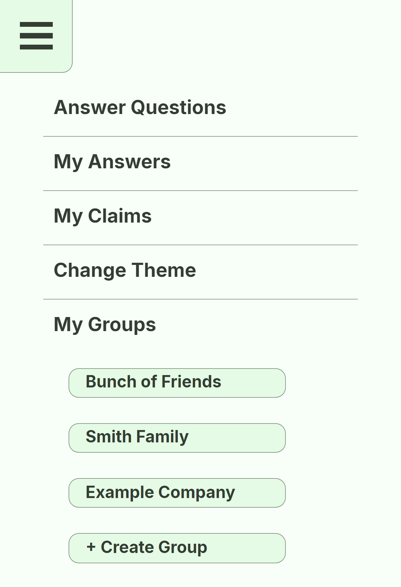
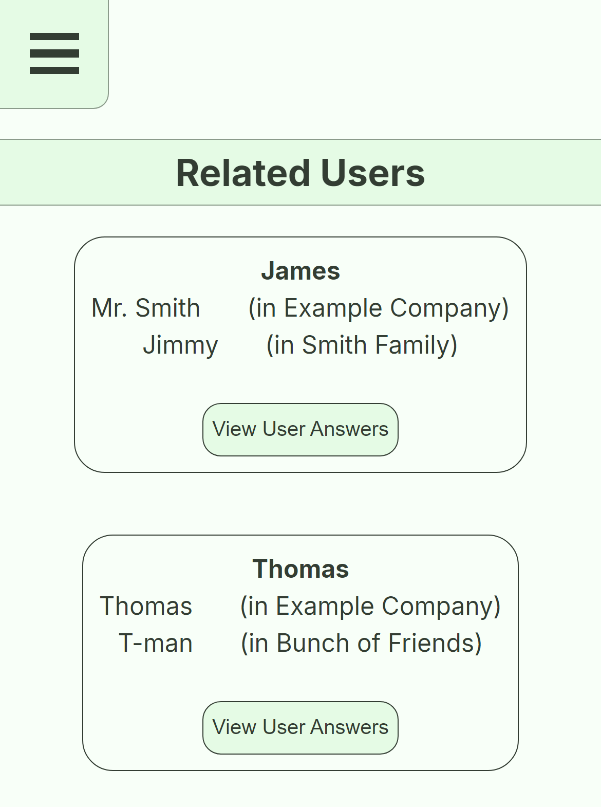
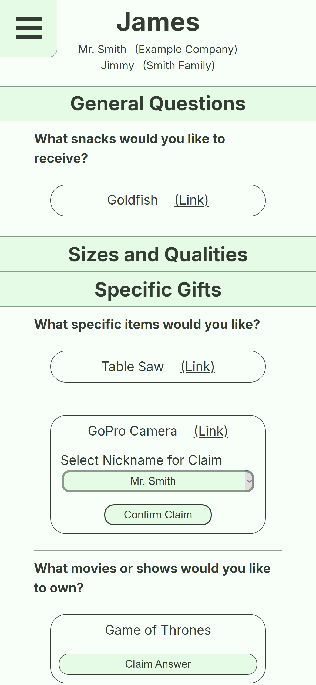
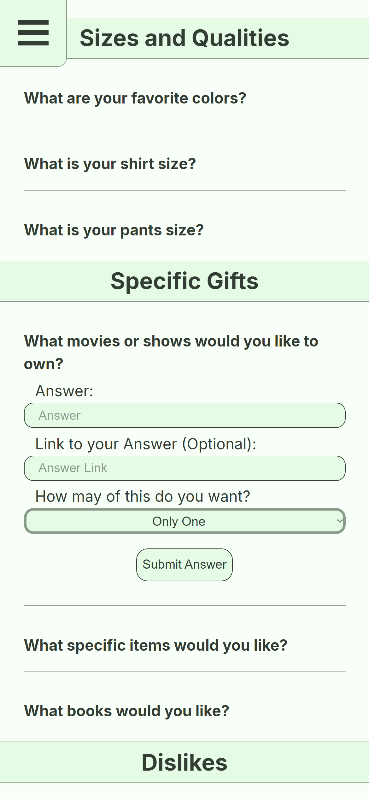
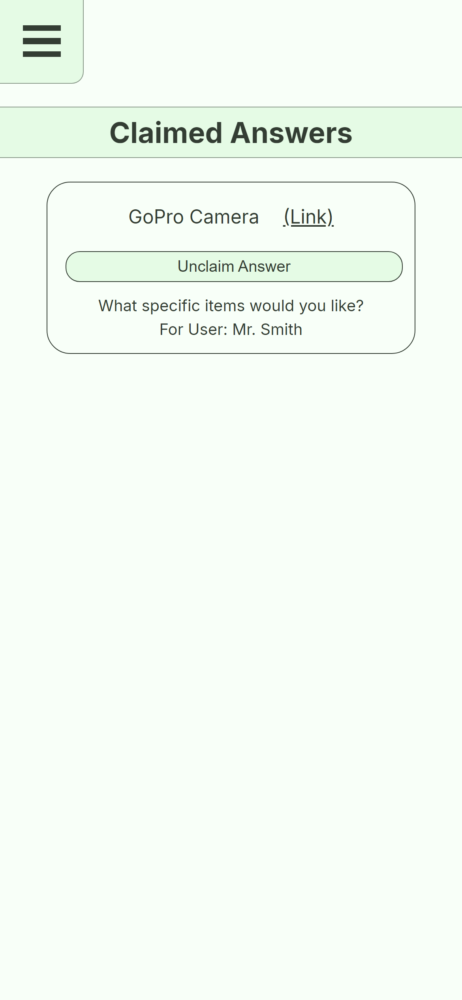
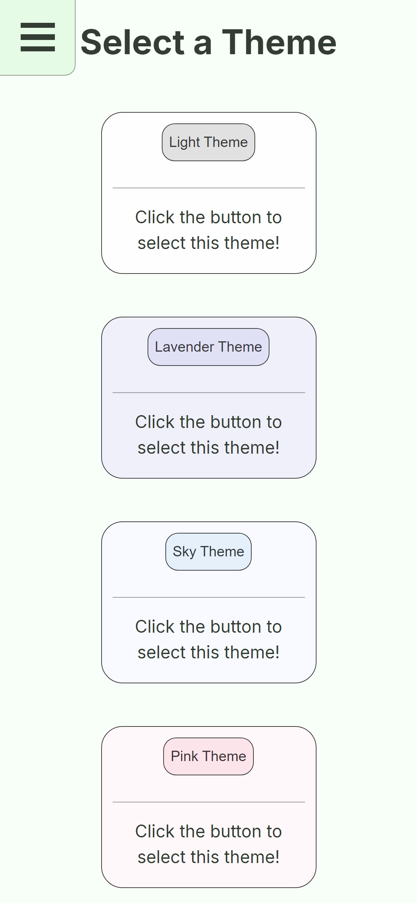

# README

## Description

This repository is for a Gift Registry consisting of a MongoDB based Node server back end and a React front end.  The registry contains multiple users across multiple families or groups.  Each user will answer questions ranging from general interests and favorite genres to specific gifts.  There is a general set of questions available to everyone as well as the ability to add questions for the group.  Answers for general questions (e.g. interests or genres) are simply visible, while answers for specific questions (e.g a specific gift or a certain book/movie) can be claimed.  A gift that will show as claimed to anyone looking to buy for the user, but not for the user themself.  An invite link to a family can be generated on the family page, and will bring the user to the Join Family page, after Login/Signup if needed.

## Visuals
| Profile Page | Friends Page |
|:-:|:-:|
|||
| User Answers Page | Questions Page |
|||
| My Claims Page | Select Theme Page |
|||

## Usage

From the root of the repo, run "npm run install" and then "npm run set-default".  Once done, "npm run develop" will host the database and website, allowing queries via /graphql or directly on the locally hosted website.

## Technologies Used

HTML 5, CSS 3, Javascript ES6+, node.js, express, React, Mongoose, Bcrypt, JWT

## Links <!-- TODO: Links in README -->

[Page Link]()

[Repository link (Github)](https://github.com/jtschams/gift-registry)

[Author Github Profile](https://github.com/jtschams)

## License

Licensed under the MIT license. Copyright @ MIT. All rights reserved.
